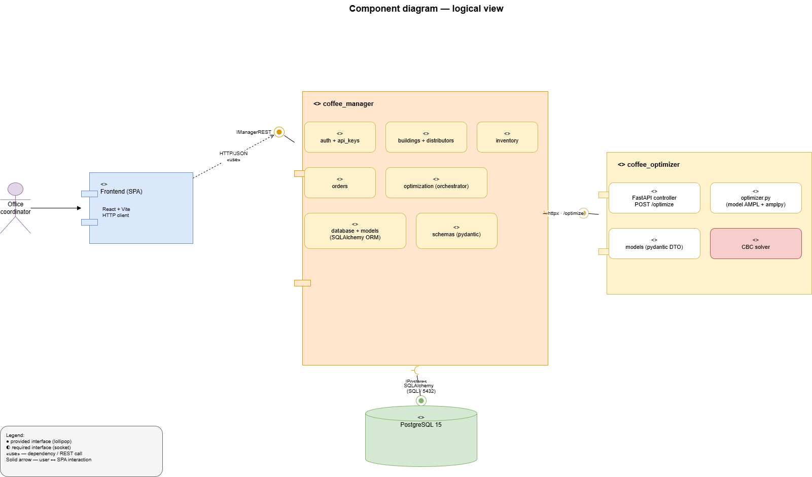
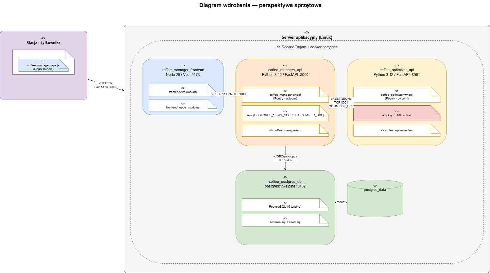
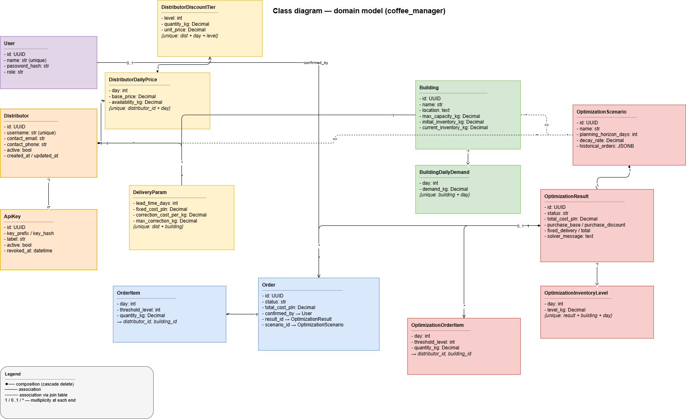
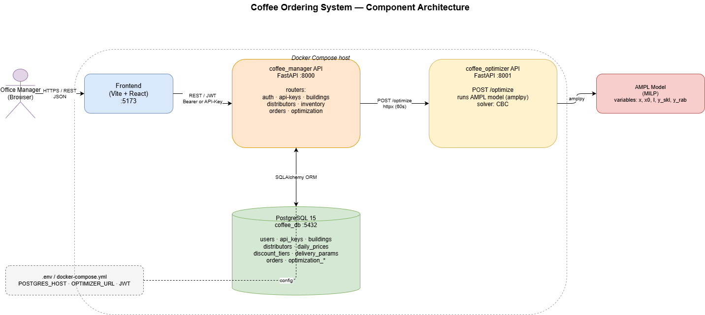
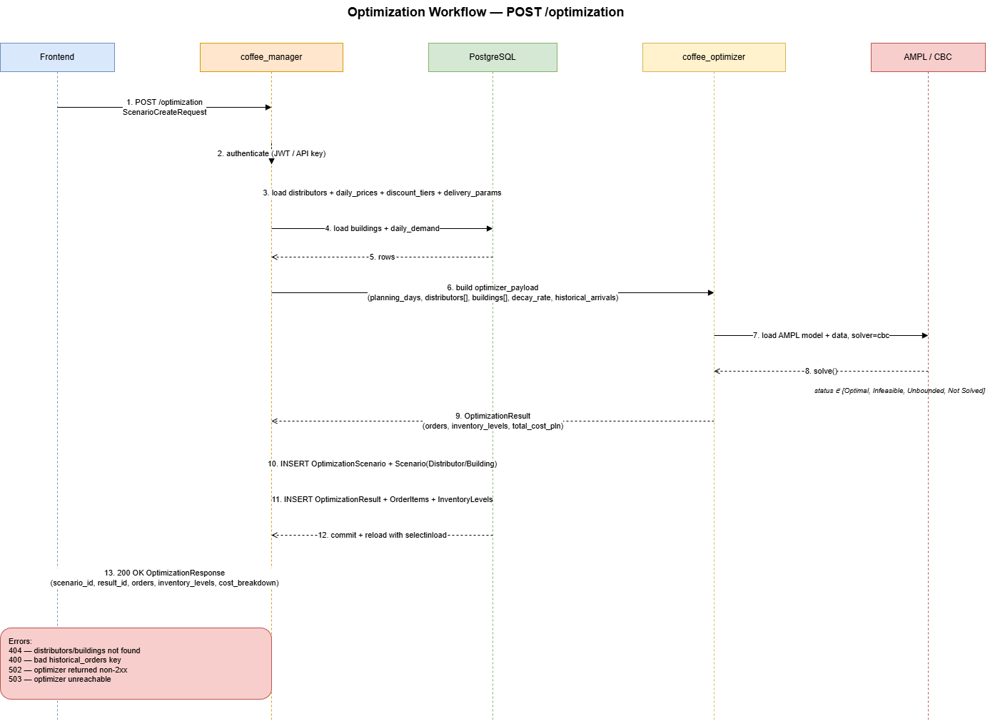
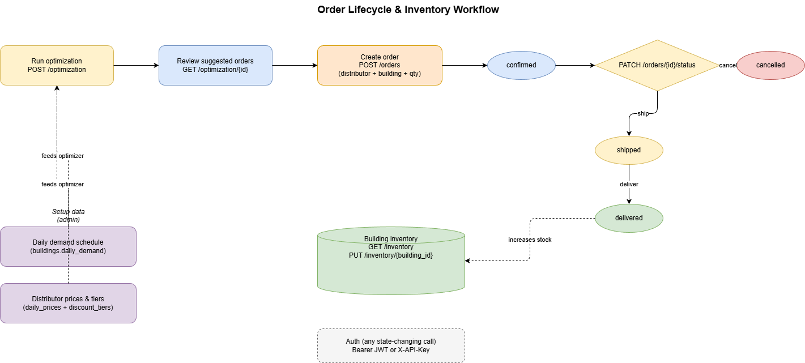

# System Architecture

This document describes the architecture of the Coffee Ordering System from the two perspectives required by the project specification:

1. **Logical / functional view** — which components and modules the system is built from, what interfaces they provide and consume, and how they communicate with each other.
2. **Hardware / deployment view** — which nodes (containers / machines) host the individual artifacts.

A class diagram of the domain model (data layer) is included as a third UML view.

## 1. Logical view — component diagram

The system consists of three application components and one data component:

| Component | Role | Technology |
|---|---|---|
| **Frontend (SPA)** | UI for the office coordinator — CRUD forms, order list, triggering optimization, visualising results. | React + Vite, HTTP client |
| **coffee_manager** | Main business service. Handles authentication, catalog CRUD (buildings, distributors), order management and optimization orchestration. Reads and writes the database. | Python 3.12, FastAPI, SQLAlchemy, Pydantic, Poetry |
| **coffee_optimizer** | Stateless compute service. Receives a self-contained payload, builds an MILP model in AMPL, solves it with CBC and returns the order plan + inventory trajectory. | Python 3.12, FastAPI, amplpy, CBC |
| **PostgreSQL** | Durable storage for all domain data and optimization results. | PostgreSQL 15 |

### Modules inside `coffee_manager`

Each module corresponds to a single FastAPI router:

- `auth` — login (JWT), user registration; `get_current_user` is a shared dependency of all other routers.
- `api_keys` — issuing and revoking API keys (alternative to JWT for service-to-service traffic).
- `buildings` — CRUD for buildings + the daily demand schedule (`daily_demand`).
- `distributors` — CRUD for distributors + daily prices, discount tiers, delivery parameters.
- `inventory` — read and adjust the current stock level.
- `orders` — order lifecycle (`confirmed → shipped → delivered`, or `cancelled`).
- `optimization` — **orchestrator**: gathers data from the database, calls `coffee_optimizer`, persists the result (`OptimizationScenario`, `OptimizationResult`, `OptimizationOrderItem`, `OptimizationInventoryLevel`).
- `database` + `models` — database access layer (SQLAlchemy `Base`, sessions, ORM models).
- `schemas` — Pydantic DTOs validating HTTP input/output.

### Modules inside `coffee_optimizer`

- `main.py` — FastAPI controller: `POST /optimize`, `GET /health`.
- `optimizer.py` — AMPL model definition (variables `x0`, `x`, `I`, binaries `y_skl`, `y_rab`), data binding, CBC invocation via `amplpy`, result extraction.
- `models.py` — Pydantic request/response DTOs.

### Interfaces (explicit contracts)

The component diagram uses UML lollipop/socket notation for interfaces.

| Interface | Provided by | Required by | Protocol |
|---|---|---|---|
| `IManagerREST` | `coffee_manager` | Frontend SPA (and external clients with an API key) | HTTP/REST + JSON, JWT Bearer or `X-API-Key`, OpenAPI in `swagger.yaml`. |
| `IOptimizer` | `coffee_optimizer` | `coffee_manager` (the `optimization` router) | HTTP/REST + JSON; a single operation `POST /optimize` with `OptimizationRequest` → `OptimizationResult`. |
| `IPostgres` | PostgreSQL 15 | `coffee_manager` | SQL connection (psycopg) to the `coffee_db` database, accessed via SQLAlchemy ORM, port 5432. |

### Connections and dependency direction

Key properties:

- The dependency is **one-way**: the optimizer never calls the manager or the database; the manager is never called by the optimizer.
- `coffee_optimizer` is **stateless** — it receives the full input in the request and returns the full output in the response. This makes it horizontally scalable and easy to test in isolation.
- Communication between `coffee_manager` and `coffee_optimizer` uses the `httpx` library with a 60 s timeout. The service address comes from the `OPTIMIZER_URL` environment variable.
- Errors from calling the optimizer are mapped to manager-side HTTP codes: 502 (HTTP error) or 503 (network error).

## 2. Hardware view — deployment diagram

The system runs on a single **application server (Linux)** with `Docker Engine` plus `docker compose`. Four containers live inside that execution environment:

| Node / container | Image / runtime | Host port | Internal artifacts |
|---|---|---|---|
| `coffee_manager_frontend` | Node 20 + Vite dev server | `5173` | `frontend/src` (bind mount), `frontend_node_modules` volume |
| `coffee_manager_api` | Python 3.12 + FastAPI/uvicorn (Poetry) | `8000` | `coffee_manager` package, `.env` file, bind mount on `coffee_manager/src` |
| `coffee_optimizer_api` | Python 3.12 + FastAPI/uvicorn (Poetry) | `8001` | `coffee_optimizer` package, `amplpy`, CBC solver |
| `coffee_postgres_db` | `postgres:15-alpine` | `5432` | `schema.sql` + `seed.sql` mounted into `/docker-entrypoint-initdb.d`, `postgres_data` volume |

On the user side there is a **user workstation** with a web browser running the compiled SPA bundle.

### Hardware-level communication channels

| Connection | Protocol / port | Notes |
|---|---|---|
| Browser → frontend (Vite) | HTTP, TCP 5173 | Replaced with static bundle serving in production |
| Browser → `coffee_manager_api` | HTTP/REST, TCP 8000 | JWT in the `Authorization` header or `X-API-Key` |
| `coffee_manager_api` → `coffee_optimizer_api` | HTTP/REST, TCP 8001 | Internal compose network; address from `OPTIMIZER_URL` |
| `coffee_manager_api` → `coffee_postgres_db` | SQL/psycopg, TCP 5432 | Container hostname: `db:5432` |
| `coffee_postgres_db` ↔ `postgres_data` volume | mount | Database durability across restarts |

### Configuration variables (`.env`)

The manager reads configuration via `coffee_manager.config.settings`. The most important variables are:

- `POSTGRES_HOST`, `POSTGRES_PORT`, `POSTGRES_USER`, `POSTGRES_PASSWORD`, `POSTGRES_DB`
- `JWT_SECRET`, `JWT_ALGORITHM`, `ACCESS_TOKEN_EXPIRE_MINUTES`
- `OPTIMIZER_URL` (e.g. `http://optimizer:8001`)

## 3. Domain model — class diagram

The diagram shows the persistence entities (SQLAlchemy models from `coffee_manager/models.py`) together with multiplicities and the kind of relationship (composition vs. association). The most important relationships are:

- `Distributor` 1 ◆── * `DistributorDailyPrice` 1 ── * `DistributorDiscountTier`
- `Distributor` * ── * `Building` via `DeliveryParam` (delivery parameters between a specific distributor and a building)
- `Building` 1 ◆── * `BuildingDailyDemand`
- `OptimizationScenario` * ── * `Distributor` and `Building` (through the `optimization_scenario_*` join tables)
- `OptimizationScenario` 1 ◆── * `OptimizationResult` 1 ◆── * `OptimizationOrderItem` / `OptimizationInventoryLevel`
- `Order` 1 ◆── * `OrderItem`; `Order` references the `OptimizationResult` and `OptimizationScenario` it came from, plus the `User` who confirmed it.

## 4. Supplementary views

The following behavioural diagrams complete the picture of the system:

### 4.1. Combined view (components + deployment)

### 4.2. Sequence diagram — `POST /optimization` flow

### 4.3. Order lifecycle

